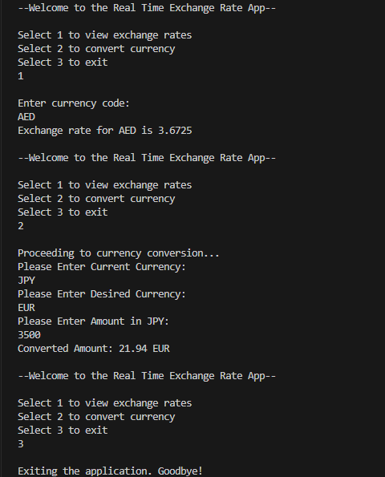

# Exchange-Rates
This program checks real-time currency exchange rates using the [ExchangeRatesAPI](https://www.exchangerate-api.com/). It fetches JSON data from [ExchangeRatesAPI](https://www.exchangerate-api.com/) to display the exchange rates for various currencies against a base currency (USD). This tool is perfect for tracking and calculating exchange rates quickly.

- HOW TO USE:
    Obtain a free api key from https://www.exchangerate-api.com/ amd input in the variable "key"

# Example:

